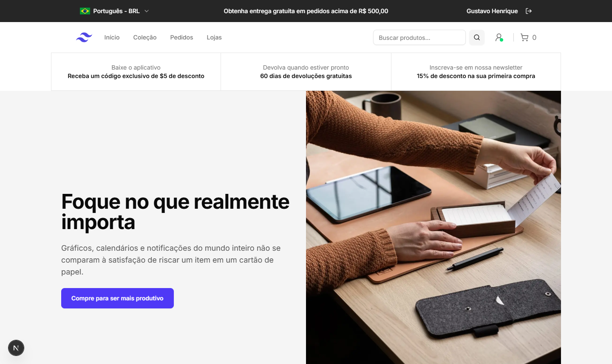
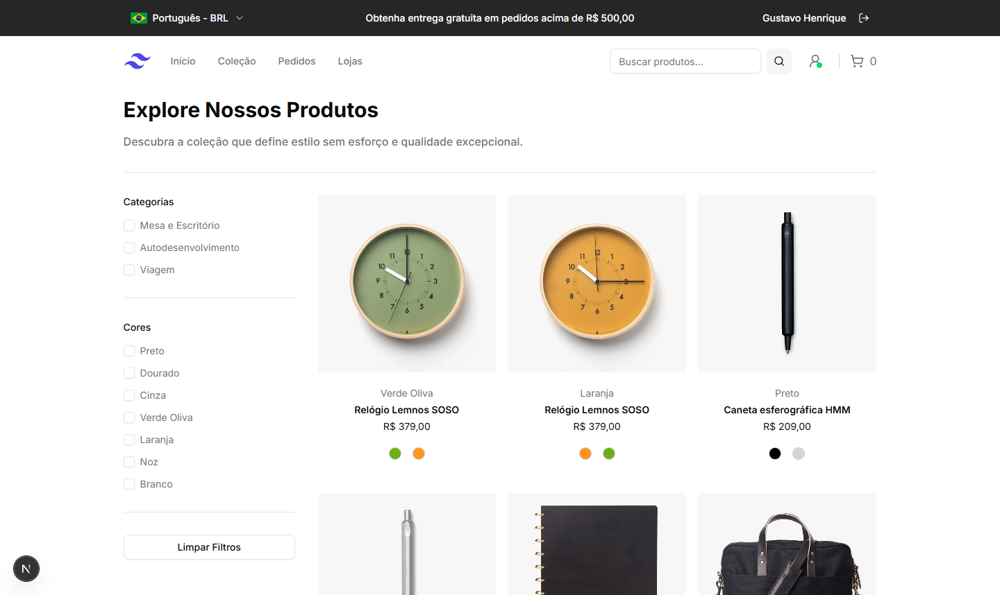
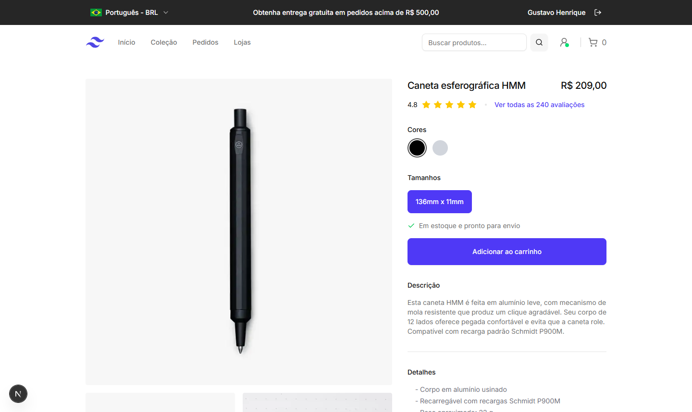
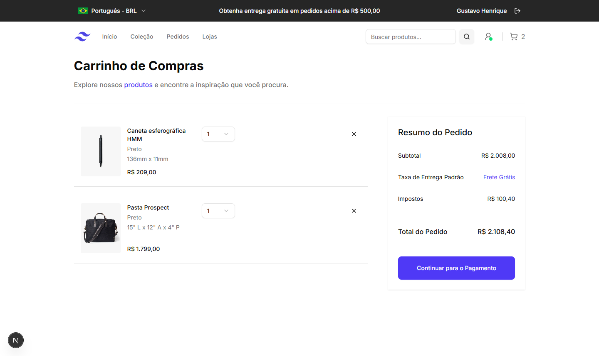
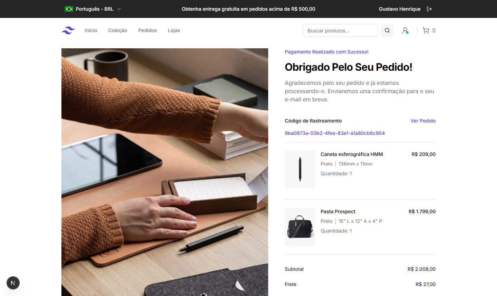

# 🛍️ TailwindStore

TailwindStore é um e-commerce de produtividade desenvolvido com **Next.js**, **TypeScript** e **TailwindCSS**, com foco em performance, responsividade e boas práticas.  
O projeto simula uma loja real, com todo o fluxo de compra implementado: catálogo, carrinho, checkout, pedidos e autenticação.

Este projeto foi criado com o objetivo de praticar habilidades de desenvolvimento frontend, recriando e adaptando um [exemplo oficial](https://tailwindcss.com/plus/ui-blocks/ecommerce/page-examples/storefront-pages) do Tailwind UI com toques pessoais e foco em boas práticas.

## 📖 Sumário

- [🚀 Deploy](#-deploy)
- [✨ Funcionalidades Principais](#-funcionalidades-principais)
- [🛠️ Tecnologias utilizadas](#-tecnologias-utilizadas)
- [🖼️ Screenshots](#-screenshots)
- [📦 Instalação e uso](#-instalação-e-uso)
- [📂 Estrutura do Projeto](#-estrutura-do-projeto)
- [📄 Licença](#-licença)

## 🚀 Deploy

🔗 [Acesse o projeto aqui](link-do-deploy)

## ✨ Funcionalidades Principais

- 👤 **Autenticação**: Sistema de login e autenticação de usuários para uma experiência personalizada.

- 🌍 **Internacionalização**: Suporte completo para dois idiomas (pt-BR e en-US) e suas respectivas moedas, com detecção automática.

- 🔎 **Busca e Filtragem**: Funcionalidade de busca e filtros avançados na página de coleção (por categoria e cor) para facilitar a navegação.

- 🛒 **Fluxo de Compra Completo**: Inclui as páginas de Carrinho, Checkout, Agradecimento e Histórico de Pedidos, garantindo uma jornada de compra intuitiva.

- ⚠️ **Tratamento de erros e validações**:

  - Validação completa de formulários com **Zod** + **React Hook Form**.
  - Mensagens de erro traduzidas em ambos os idiomas.
  - Tratamento de URLs inválidas e páginas não encontradas (404).

- 📱 **Design Responsivo**: O design se adapta perfeitamente a telas de desktops, tablets e smartphones, com uma interface limpa e elegante.

- ⚡ **Otimização e Boas Práticas**: Código otimizado, rotas dinâmicas e estrutura de arquivos organizada para facilitar a manutenção e futuras expansões.

## 🛠️ Tecnologias utilizadas

- [Next.js 15](https://nextjs.org/) - Framework React para SSR e SSG.
- [TypeScript](https://www.typescriptlang.org/) - Tipagem estática para maior segurança e manutenção.
- [TailwindCSS 4](https://tailwindcss.com/) - Framework CSS utilitário para design rápido e responsivo.
- [ShadCN/UI](https://ui.shadcn.com/) - Componentes de UI acessíveis e prontos para uso.
- [Zod](https://zod.dev/) & [React Hook Form](https://react-hook-form.com/) - Validação robusta e eficiente de formulários.
- [Next-Intl](https://next-intl-docs.vercel.app/) - Internacionalização (idiomas e moedas).
- [UUID](https://www.npmjs.com/package/uuid) - Geração de IDs únicos para pedidos.

## 🖼️ Screenshots

### 1. Home



### 2. Página de Coleção



### 3. Página de Produto



### 4. Carrinho



### 5. Checkout


### 6. Página de Agradecimento



## 📦 Instalação e uso

Clone o repositório:

```
git clone [https://github.com/](https://github.com/)<seu-usuario>/<nome-do-repositorio>.git
```

Instale as dependências:

```
cd <nome-do-repositorio>
npm install
```

Inicie o servidor de desenvolvimento:

```
npm run dev

Abra o navegador e acesse:

http://localhost:3000

```

Para testes rápidos, a página de checkout possui um botão para autopreencher o formulário com dados fictícios, utilizando a validação do Zod e do React Hook Form.
